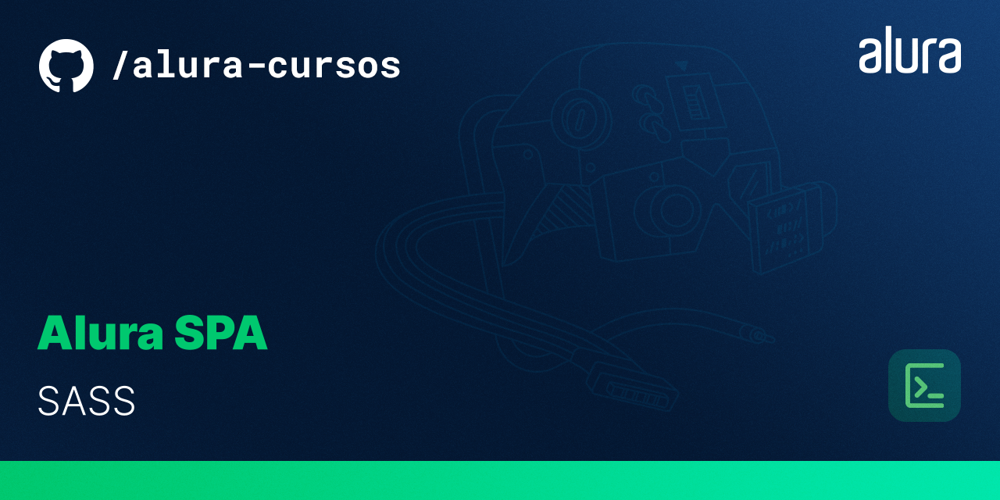

# Projeto-alura-spa-SASS

# Resumo do projeto

Home page de um SPA, estilizado utilizando o SASS e SCSS para criar os estilos e gerar um CSS com todas as vantagens que o SASS nos proporciona, como a legibilidade, modularidade e o melhor gerenciamento dos estilos.

# ✔️ Técnicas e tecnologias utilizadas

   
 
 
  
  

   

# 📁 Acesso ao projeto

Você pode acessar os arquivos do projeto clicando [aqui](https://github.com/mvergara94/projeto-alura-spa-SASS/find/main). E o link através do Github pages é [este](https://mvergara94.github.io/projeto-alura-spa-SASS/).

# Screenshot da tela inicial

 

 

# ✉️ Redes Sociais

 

 
    
   

  
 

